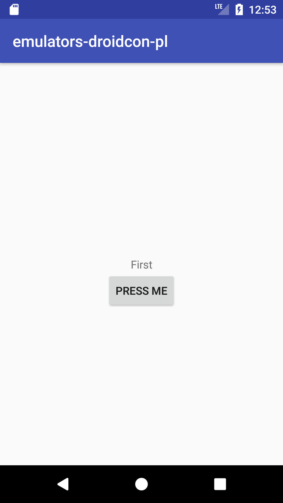
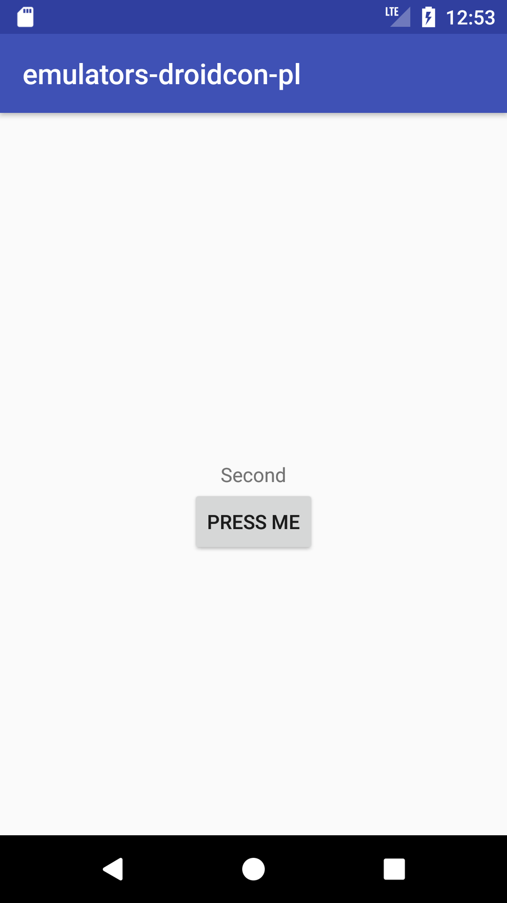

footer:  droidConPL Krakow 2017 - Emulators in Action - How to run UI tests on your CI
slidenumbers: true
build-lists: true
autoscale: true

[.slidenumbers: false]
# [fit] Emulators in Action
## How to run UI tests on your CI

^ - Welcome to my talk
 - CI is always a problem
 - maintaining emulators as well
 - We should run UI tests on CI
 - This causes problems
 - Not a regular talk about Testing (CI focussed)

---
# About me


^ - This guy used to look like me

---
# About me


- __Daniel Hartwich__
- __Android Developer at__ 
- __Twitter__: [KiLLyA_](https://www.twitter.com/KiLLyA_) 
- __GitHub__: [dhartwich1991](https://www.github.com/dhartwich1991) 

^ - My Name (Daniel Hartwich)
- I work at XING
- As Android Developer in the Platform team
- I will move to mobile Releases team
- Interested in automation
- Hate love relationshipw with Jenkins is my friend (NOT)
- Social Media and GitHub info
- Repo is in GitHub

---
### Looking for new colleagues


- 1 (Senior) Android Developer - Platform Team
- 1 Automation Android Developer - Mobile Releases Team

^ - XING is awesome
- We are looking for awesome people like you
- In Hamburg is warmer than this :) But probably more rain
- Platform: Central Team / Architecture focus / Android system features
- Releases: Managing / Automating releases / Tools team / Work with me!
- #LetsTalk after the presentation or during the day. I don't bite

---
# What is in this?
- UI Tests in Android
- Spoon 🥄
- Working setup at 
- UI Tests on CI (Jenkins)
- Fastlane
- The solution (TM)

---
# [fit] UI Tests in Android
---
- UI Tests
- Espresso

^ - We are used to Espresso tests (we should be)
- Question: Who is using Espresso?

---
```kotlin
@Test fun changesTextWhenClickingButton() {
        onView(withId(R.id.press_me_button))
                .perform(click())
        onView(withId(R.id.change_text_text)).check(matches(withText("First")))
        onView(withId(R.id.press_me_button))
                .perform(click())
        onView(withId(R.id.change_text_text)).check(matches(withText("Second")))
    }
```

- Simple view assertion
- When I click one button should show different text

^ - In order to remind you how espresso tests look like

---
 

^ - Screenshots showing the sample app.
- Tapping the button changes the text

---
### ✅

^ - Aaand everything is good, tests are green, we are ready to ship

---
### UI Tests
- (usually) quick to execute
- test UI of specific screen
- Run them with `./gradlew cAT`
- Is this enough?
- Yes...but!

^ - Different types of tests (end to end test, instrumentation tests)
- need to run on real device or emulators
- androidTest folder
- Will get you started, but there is more we can benefit from
- Enough for some (or even most) of the cases

---
# Spoon 🥄

^ - No this presentation is not about food :(

---
### Spoon
- Distribute tests to different devices
- possibility to specify those devices
- Run on different versions of Android
- Take screenshots during critical parts of your tests
- Save important files like DBs
- Test sharding!

^ - Spoon has some really awesome features that make it better than regular espresso tests
- In android world we have different devices
- Screenshotting
- Saving files
- Sharding

---
### Sounds good, Sounds fun, but how?
- Gradle Spoon plugin (recommended)
- `classpath 'com.stanfy.spoon:spoon-gradle-plugin:1.2.2'`
- ⚠️ some problems with Android Studio 3.0
- Guys are working on it. There is a snapshot (2.0) available at the moment
- `spoonDebugAndroidTest`

^ - Basic instruction on how to include spoon in your project
- Add classpath dependency
- Apply spoon plugin in app build.gradle
- tasks like spoonDebugAndroidTest are generated
- So it's awesome, we want to use it

---
# [fit] How we work at 

^ - Since we use it at XING, let me quickly explain how the setup of our Android Team is
- It will also later help with understanding the problem
- We faced it

---
- ~25 developers
- Split in independent feature teams
- Release Trains 🚂
- Code Freeze every 2 weeks
- Followed by a Release + Rollout (20% -> 50% -> 100%)
- Work on feature branches, merge to master
- Current # of open PRs:  ~40

^ - Working setup people / process wise
- App is split in section
- Per section there is a team
- A talk on it's own for the future

---
- We use Jenkins CI
- Running Unit Tests, Static Analyzers, assemble different build types etc.
- On Every PR
- Run UI Tests on CI

^ - Question: Who has used CI / CD (Jenkins, Travis)
- We run Unit Tests static analyzers etc. But we also want to run our integration tests, right?
- Otherwise it wouldn't make sense to write them
- Question: Who runs their UI tests on CI
- We really rely on CI otherwise we can't make sure that our features are constantly working and won't break with the next version

---
- Huge load on Jenkins
- Waiting for long running UI tests
- Jenkins without UI (only raw metal - Linux machines)
- Tests were failing / slow / flaky
- shell scripts magicians? 🎩

^ - We want to run UI tests on jenkins but it brought a lot of downsides.
- You might now something like the following scripts:

---
# integrationwithspoon.sh

``` sh
#!/usr/bin/env bash

# Configure pre-conditions
PACKAGE_NAME="com.xing.android"
AVD_NAME="integration-tests"
PORT=${1-6000}

##############################################################################

# Ensure the Test APK is built already.
TEST_APK_FILE="core-app/build/outputs/apk/core-app-debug-androidTest.apk"
if [ ! -f "${TEST_APK_FILE}" ]
then
    echo "Test APK doesn't exist, aborting. Make sure you run ./gradlew :core-app:assembleDebug :core-app:assembleDebugAndroidTest"
exit
else
    echo "androidTest APK Exists, continuing"
fi

# Calculate the Serial Number of the emulator instance
SERIAL=emulator-${PORT}

echo "Creating (forceful) AVD with name ${AVD_NAME}"
# We have to echo "no" because it will ask us if we want to use a custom hardware profile, and we don't.
echo "no" | android create avd \
    -n "${AVD_NAME}" \
    -k "system-images;android-22;default;x86_64" \
    -f
echo "AVD ${AVD_NAME} created."

# Start the Android Emulator
# "2>&1" combines stderr and stdout into the stdout stream
START_EMULATOR="/opt/android-sdk-linux/tools/emulator \
    -avd ${AVD_NAME} \
    -netspeed full \
    -netdelay none \
    -no-skin \
    -no-window \
    -gpu guest \
    -port ${PORT}"

echo $START_EMULATOR
$START_EMULATOR 2>&1 &

# Ensure Android Emulator has booted successfully before continuing
EMU_BOOTED='unknown'
MAX_RETRY_COUNT=27
while [[ ${EMU_BOOTED} != *"stopped"* ]]; do
    sleep 7
    EMU_BOOTED=`adb -s ${SERIAL} shell getprop init.svc.bootanim || echo unknown`

    # Exit if the emulator didin't start in 140 seconds.
    MAX_RETRY_COUNT=$(($MAX_RETRY_COUNT - 1))
    if [[ $MAX_RETRY_COUNT -eq 0 ]]; then
        echo "Emulator startup timeout. Aborting"
        exit 1
    fi
done

duration=$(( SECONDS - start ))
echo "Android Emulator started after $duration seconds."

# Use the Spoon utility as a test runner
SPOON_COMMAND="./gradlew --no-daemon spoonDebugAndroidTest -PspoonDevice=emulator-${PORT}"
echo "Running: ${SPOON_COMMAND}"
${SPOON_COMMAND}

```

---

# kill-emulator.sh

``` sh
#!/usr/bin/env bash

##############################################################
#
# KILL-EMULATOR
#
# Kills an Android emulator which requires authentication.
# It works by opening a telnet session and authenticates, before issuing the
# kill command.
#
# Usage: `kill-emulator.sh <port>`
# where <port> is optional (defaults to 6000)
#
# Since SDK Tools 25.1.6, the Android emulator has required authentication
# before any commands can be run on it. This breaks commands such as
# `adb emu kill`.
#
# References:
# - https://developer.android.com/studio/run/emulator-commandline.html#console-session
# - https://code.google.com/p/android/issues/detail?id=21021#
#
##############################################################

# Read port form the console
PORT=${1-6000}
# Read token for emulator
TOKEN=$(<$HOME/.emulator_console_auth_token)

# Notify user that everything is going to be OK
echo "Killing emulator on port $PORT with auth token $TOKEN"

# Start telnet and pray that it will work
TELNET=`(
    echo "auth $TOKEN";
    sleep 1;
    echo "kill";
    sleep 1
) | telnet localhost $PORT | grep "OK: killing emulator, bye bye"`
if [ "$?" -ne 0 ]; then
  echo "Couldn't kill emulator $PORT. Aborting"
  exit 1
else
  echo "Emulator dead"
  exit 0
fi

```

---
> "# Start telnet and pray that it will work"
> - kill-emulator.sh -

^ - Excerpt from the script

---

# :poop:

---
__Why?__
- Unmaintainable
- What if you die?
- What if one of the scripts fails
- Too many cases you can't handle
- Flaky / Slow
- People will not trust in tests
- And bother you a lot...

^ - What is the problem with these scripts?
- Who can take over if you are not there

---

### Problem: How do you create/manage emulators etc. on Jenkins?

^ - Setting up SDK is hard enough with accepting licenses etc. upgrading sdk etc.
- Emulators only make the problem worse
- We need to have a solution

---
# [fit] fastlane (to the rescue)


^ - Last year on droidcon austria I was introduced to fastlane tool
- Girl from Formerly fabric/twitter

---
### fastlane
- ruby tool to handle tedious tasks
- mainly focussed on releasing applications
- super cool
- has lots of plugins
- huge community
- "over __10,391,703__ Developer Hours Saved"

^ - easily create screenshots of your app
- publish it to playstore
- add translations / release notes

---

- `sudo gem install fastlane -NV`
- `fastlane init` inside your existing project
- Ready to go!
- Create your 'lanes' (definitions of tasks) inside `Fastfile`

^ - So how to get started with fastlane?
- Question: Who heard about fastlane is using fastlane?

---

__Espresso lane__

``` ruby
desc "Run UI tests using default test runner"
lane :espresso_test do
  gradle(task: "cAT")
end

```
_Run command: `fastlane espresso_test`_

__spoon lane__

``` ruby
desc "Run UI tests using spoon"
  lane :espresso_spoon_test do
    gradle(task: "spoonDebugAndroidTest")
  end

```
_Run command: `fastlane espresso_spoon_test`_

^ - Describe how the commands work / what they do really simple
- many plugins for posting results to hipchat / slack / email

---

- How does this help us?
- it doesn't
- we still have the same problem with emulators
- what to do?
- Plugin magic

^ - This simpleflies running tests (makes it easier to run them)

---
### fastlane-plugin-automated-test-emulator-run

---
- Wraps gradle/shell tasks
- Creates and manages emulators
- easy to configure
- start multiple emulators
- `fastlane add_plugin automated_test_emulator_run`
- create AVD(emulator) config using JSON

^ - This will take care about the emulator lifecycle
- Kill them if something goes wrong or fails
- create them every time and wait for them to boot
- No manual work required

---
``` json
{
    "avd_list": [
        {
          "avd_name": "Test-Emulator-API23-Nexus-5-1",

          "create_avd_package": "system-images;android-23;google_apis;x86_64",
          "create_avd_device": "Nexus 5X",
          "create_avd_tag": "google_apis",
          "create_avd_abi": "x86_64",
          "create_avd_additional_options": "",
          "create_avd_hardware_config_filepath": "~/Android/AVD_Snapshots/Nexus_5X_API_23/Test-Emulator-API23-Nexus-5-1.ini",

          "launch_avd_port": "",
          "launch_avd_snapshot_filepath": "~/Android/AVD_Snapshots/Nexus_5X_API_23/Nexus_5X_API_23_SNAPSHOT.img",
          "launch_avd_launch_binary_name": "emulator",
          "launch_avd_additional_options": "-gpu on"
        },
        {
          "avd_name": "Test-Emulator-API23-Nexus-5-2",

          "create_avd_package": "system-images;android-26;google_apis;x86_64",
          "create_avd_device": "Nexus 5X",
          "create_avd_tag": "google_apis",
          "create_avd_abi": "x86_64",
          "create_avd_additional_options": "",
          "create_avd_hardware_config_filepath": "~/Android/AVD_Snapshots/Nexus_5X_API_26/Test-Emulator-API26-Nexus-5-2.ini",

          "launch_avd_port": "",
          "launch_avd_snapshot_filepath": "~/Android/AVD_Snapshots/Nexus_5X_API_23/Nexus_5X_API_26_SNAPSHOT.img",
          "launch_avd_launch_binary_name": "emulator",
          "launch_avd_additional_options": "-gpu on"
        }
    ]
}
```

---
- You can configure everything from here you would normally need to do from command line
- It is easy to read
- Other people can maintain/tweak it
- It scales (why not use 3,4 or 5 emulators?)

^ - As we heard yesterday it depends on your machine how many emulators you can create / use

---
- Now we can create lanes to use this plugin

- ``` ruby
desc "Runs tests with AVD setup according to JSON file config with usage of spoon."
  lane :Automation_EmulatorRun_Spoon do
      automated_test_emulator_run(
        AVD_setup_path: "fastlane/avdconfig/AVD_setup.json",
        gradle_task:"spoonDebugAndroidTest"
      )
end
```

- Now let's run it.
- `fastlane Automation_EmulatorRun_Spoon`

^ - We don't actually run it. We would see how two devices get created and all tests are running

---

- Yayyyy!
- This handles emulator creation
- We can run multiple emulators with different versions
- easy to maintain
- are we done?

---
# [fit] 

---

- We are still ~25 developers
- We have 4 Jenkins slaves
- 1 slave = 1 computer
- 8 nodes per slave (same computer)
- multiple ui test jobs can run on the same jenkins slave

^ - Don't talk about interference here. It's in the next slide :D

---

- spoon tests are executed on all connected devices
- Tests on the same node interfere with each other
- Tests get flaky again.
- Tests are still slow

^ - Spoon by default runs all tests on all connected devices
- Interference NOW!

---

# [fit] REMEMBER!!! - You can specify target devices on spoon

---

- We don't know what are the names of the emulators that get created by the plugin
- Something with emulator-${portNumber}
- How do we connect our spoon test run with the created emulators?

---

Spoon configuration (build.gradle)

``` groovy
spoon {
            debug = true
            shard = true
            devices = ['emulator-5556', 'emulator-5558']
}
```

- You can specify target devices using the devices array

---

# Mhhhh 🤔

---
- This is it!
- We need a way to set devices from our emulator plugin
- It knows which ports it assigned
- And thus can pass the names to the gradle task it executes

---
- The current plugin does not support this.
- But it's open source
- So we can tweak it!

---

``` ruby
# Launching tests
         shell_task = "#{params[:shell_task]}" unless params[:shell_task].nil?
         gradle_task = "#{params[:gradle_task]}" unless params[:gradle_task].nil?
         spoon_task = "#{params[:spoon_task]}" unless params[:spoon_task].nil?
```

- Created `spoon_task`

^ - ShellTask and Gradle task where already there

---
### Tweaking the plugin

[.autoscale: true]
``` ruby
              ports = Array.new
              spoon_devices = " -PspoonDevice="
              spoon_devices = spoon_devices + "emulator-" + avd_schemes[0].launch_avd_port.to_s
              for i in 1...avd_schemes.length
                ports << avd_schemes[i].launch_avd_port
                spoon_devices = spoon_devices + ",emulator-" + avd_schemes[i].launch_avd_port.to_s
              end

              gradle_spoon_task = params[:spoon_task]
gradle_spoon_task = gradle_spoon_task + spoon_devices
```

^ - Explain this slide line by line
- Create an array named ports
- start creating the command line parameter we will pass later
- add all devices we store in the avd_schemes array
- Pass prepared spoonDevices flag to the given gradle task

---

- Create a new lane inside your Fastfile
- use `spoon_task` instead of `gradle_task`
- -pSpoonDevice will be passed to the task that is executed
- We need to read this value in build.gradle
- And configure our spoon to run on the passed emulators

^ - After publishing this we can do the following steps

---
`./gradlew spoonDebugAndroidTest -pSpoonDevice=emulator-5556, emulator-5558`

``` groovy
spoon {
           if (project.hasProperty('spoonDevice')) {
               devices = []
               project.properties['spoonDevice'].split(',').each {
                   devices += [it]
               }
           }
```

- This reads -pSpoonDevice flag
- and propagates `devices[]` with emulator names

---
- Now the tests will execute only on the devices created for the fastlane task we execute
- Tasks are now independent from each other
- Less failure due to interference
- Test runs get way faster
- Developers like if they don't need to retry to run the tests multiple times

---

# ✅
## [fit] Mission Accomplished
# ✅
- ?

^ - Mission accomplished! Do we, really?
- We can now run 4-5 ui tests tasks in parallell and they don't care about each other

---

### Remaining Problems

- Sometimes can still be flaky (ADB issues)
- Emulators still don't get shut down properly
- Too much load on jenkins
- No retrying of flaky tests
- Still not perfect, but improving the current situation

^ - ADB refuses connection because too much spam on it
- Test run duration significantly faster
- Looking forward to further improvements

---

# Thank you :heart:

---

## Questions?
